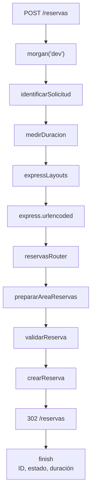
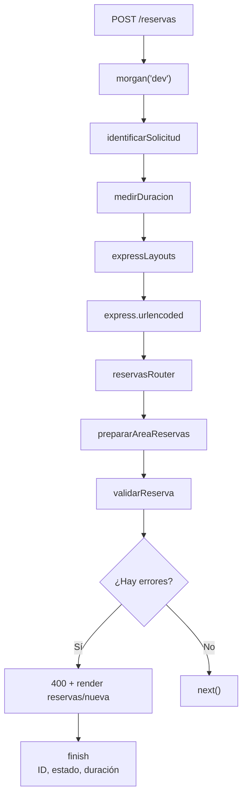

# Trabajo práctico 05

## Descripción

Este proyecto implementa un sistema web de reservas de salas utilizando Node.js, Express y EJS.

La aplicación permite:

* Consultar las reservas existentes.
* Ver el detalle de una reserva.
* Crear nuevas reservas.
* Validar los datos enviados mediante un formulario.
* Mostrar errores de validación conservando los datos ingresados.
* Consultar el estado del servicio.
* Identificar cada solicitud mediante un ID.
* Medir la duración de las solicitudes.
* Registrar información de las solicitudes mediante Morgan.

Las nuevas reservas se almacenan únicamente en memoria, por lo que se pierden cuando se reinicia el servidor.

---

## Instalación

Clonar o descargar el proyecto y ubicarse dentro de la carpeta:

```bash
cd tp-05-salas-middleware
```

Instalar las dependencias:

```bash
npm install
```

Las principales dependencias utilizadas son:

* `express`
* `ejs`
* `express-ejs-layouts`
* `morgan`

---

## Ejecución

Para iniciar el servidor:

```bash
npm start
```

El servidor queda disponible en:

```text
http://localhost:3000
```

También se puede verificar la sintaxis del archivo principal mediante:

```bash
npm run check
```

---

## Rutas

### GET `/`

Muestra la página de inicio del sistema.

### GET `/estado`

Devuelve información sobre el estado del servicio en formato JSON.

Ejemplo:

```json
{
  "servicio": "activo",
  "reservas": 4,
  "solicitudId": "BIB-0001"
}
```

### GET `/reservas`

Muestra el listado de todas las reservas registradas.

### GET `/reservas/nueva`

Muestra el formulario para crear una nueva reserva.

### POST `/reservas`

Recibe los datos enviados desde el formulario.

Los datos pasan primero por el middleware `validarReserva`.

Si los datos son válidos, se ejecuta `crearReserva`, se agrega la reserva al arreglo en memoria y se realiza una redirección hacia:

```text
/reservas
```

La respuesta de la creación es un código HTTP `302`.

### GET `/reservas/:id`

Muestra el detalle de una reserva determinada por su ID.

Si la reserva no existe, se responde con código `404` y se muestra la vista `no-encontrado.ejs`.

### Rutas inexistentes

Cualquier ruta que no coincida con las anteriores termina en el middleware final de 404.

---

## Pipeline de middleware

El proyecto utiliza diferentes tipos de middleware.

Para las solicitudes generales se ejecutan los middleware globales configurados en la aplicación.

El pipeline principal incluye:

```text
morgan("dev")
        ↓
identificarSolicitud
        ↓
medirDuracion
        ↓
express-ejs-layouts
        ↓
express.urlencoded
        ↓
rutas de la aplicación
```

En las rutas de reservas se agrega el middleware correspondiente al router:

```text
reservasRouter
        ↓
prepararAreaReservas
        ↓
middleware de la ruta
```

Para el POST de creación de una reserva:

```text
POST /reservas
        ↓
morgan("dev")
        ↓
identificarSolicitud
        ↓
medirDuracion
        ↓
express-ejs-layouts
        ↓
express.urlencoded
        ↓
reservasRouter
        ↓
prepararAreaReservas
        ↓
validarReserva
        ↓
crearReserva
```

---

## Diagrama del POST válido

El siguiente diagrama representa el flujo solicitado para un POST válido de `/reservas`.



En este caso, `validarReserva` considera correctos todos los datos recibidos y ejecuta `next()`, permitiendo que la solicitud continúe hasta `crearReserva`.

`crearReserva` agrega la nueva reserva al arreglo en memoria y realiza:

```js
res.redirect("/reservas");
```

Esto genera una respuesta HTTP `302`.

Luego el navegador realiza un nuevo:

```text
GET /reservas
```

Finalmente, el evento `finish` permite que `medirDuracion` registre el ID de solicitud, el código de estado y la duración.

---

## Diagrama del POST inválido

Cuando los datos enviados no cumplen las reglas de validación, el flujo termina en `validarReserva`.



En este caso, `validarReserva` detecta uno o más errores y responde directamente:

```js
return res.status(400).render("reservas/nueva", {
  errores,
  datos: {
    estudiante,
    email,
    sala,
    fecha,
    turno,
    personas: req.body.personas || ""
  }
});
```

Por este motivo no se ejecuta `crearReserva`.

El flujo termina funcionalmente en `validarReserva`.

---

## Alcance de cada función

En Express se pueden encontrar middleware con diferentes alcances.

### Alcance global

Los middleware globales se registran directamente sobre `app`.

En este proyecto:

```js
app.use(morgan("dev"));
app.use(identificarSolicitud);
app.use(medirDuracion);
```

Estos middleware pueden ejecutarse para diferentes rutas de la aplicación.

También se utilizan middleware incorporados como:

```js
app.use(express.static("public"));
app.use(express.urlencoded({ extended: true }));
app.use(express.json());
```

### Alcance de router

Los middleware de router se registran sobre `reservasRouter`.

En este proyecto:

```js
reservasRouter.use(prepararAreaReservas);
```

Por lo tanto, `prepararAreaReservas` se ejecuta solamente para las rutas que pertenecen al router de reservas.

### Alcance de ruta

Un middleware de ruta se coloca específicamente dentro de una ruta.

En este proyecto:

```js
reservasRouter.post("/", validarReserva, crearReserva);
```

En esta ruta:

1. Se ejecuta `validarReserva`.
2. Si los datos son correctos, llama a `next()`.
3. Luego se ejecuta `crearReserva`.

---

## Middleware incorporado, de terceros y personalizado

### Middleware incorporado

Son middleware proporcionados por Express.

En este proyecto se utilizan:

```js
express.static("public")
express.urlencoded({ extended: true })
express.json()
```

`express.static` permite servir archivos estáticos.

`express.urlencoded` permite interpretar datos enviados mediante formularios HTML.

`express.json` permite interpretar solicitudes que contienen datos JSON.

### Middleware de terceros

Son paquetes instalados mediante npm.

En este proyecto se utilizan:

```js
morgan("dev")
```

y:

```js
express-ejs-layouts
```

Morgan registra información de las solicitudes HTTP.

`express-ejs-layouts` permite utilizar un layout común para las vistas EJS.

### Middleware personalizado

Son funciones creadas específicamente para este proyecto.

Entre ellas:

```js
identificarSolicitud
medirDuracion
prepararAreaReservas
validarReserva
```

Cada una tiene una responsabilidad específica dentro del flujo de procesamiento.

---

## `next()`

`next()` permite continuar la ejecución hacia el siguiente middleware o handler de la cadena.

Por ejemplo:

```js
function prepararAreaReservas(req, res, next) {
  res.locals.seccion = "Reservas de salas";
  next();
}
```

Primero se prepara el dato:

```js
res.locals.seccion = "Reservas de salas";
```

Luego:

```js
next();
```

permite que la solicitud continúe.

En `validarReserva`, `next()` solamente se ejecuta cuando no existen errores:

```js
if (errores.length > 0) {
  return res.status(400).render("reservas/nueva", {
    errores,
    datos
  });
}

next();
```

Si existen errores, la función responde directamente y no llama a `next()`.

---

## Parsers antes de validar

Los parsers deben ejecutarse antes de los middleware que necesitan acceder a los datos enviados por el cliente.

En este proyecto se utiliza:

```js
app.use(express.urlencoded({ extended: true }));
```

antes de la ruta:

```js
reservasRouter.post("/", validarReserva, crearReserva);
```

Esto permite que los datos enviados mediante el formulario estén disponibles en:

```js
req.body
```

Por ejemplo:

```js
const estudiante = (req.body.estudiante || "").trim();
```

Si `express.urlencoded` no se ejecutara previamente, el middleware de validación no podría utilizar correctamente los datos del formulario.

---

## Identificación de solicitudes

El middleware `identificarSolicitud` genera un identificador único para cada solicitud:

```js
let solicitudId = 0;

function identificarSolicitud(req, res, next) {
  solicitudId++;

  const idFormateado = `BIB-${String(solicitudId).padStart(4, "0")}`;

  res.locals.solicitudId = idFormateado;

  next();
}
```

Los identificadores tienen el siguiente formato:

```text
BIB-0001
BIB-0002
BIB-0003
```

El identificador se almacena en:

```js
res.locals.solicitudId
```

De esta forma puede ser utilizado posteriormente por las vistas y por otros middleware.

---

## Duración de las solicitudes y evento `finish`

El middleware `medirDuracion` registra el momento en que comienza la solicitud:

```js
const inicio = Date.now();
```

Después registra una función para el evento:

```js
res.on("finish", () => {
  ...
});
```

El evento `finish` ocurre cuando la respuesta HTTP ya fue enviada.

Dentro del evento se calcula la duración:

```js
const duracion = Date.now() - inicio;
```

Y se muestra información como:

* ID de solicitud.
* Método HTTP.
* URL solicitada.
* Código de estado.
* Duración de la solicitud.

Ejemplo:

```text
[BIB-0001] POST /reservas 302 - 8ms
```

Esto permite conocer cuánto tiempo tardó en completarse una solicitud.

---

## Montaje del router

El router de reservas se crea mediante:

```js
const reservasRouter = express.Router();
```

Las rutas relacionadas con las reservas se definen dentro de ese router.

Finalmente se monta sobre `/reservas`:

```js
app.use("/reservas", reservasRouter);
```

Esto significa que una ruta definida como:

```js
reservasRouter.get("/");
```

queda disponible como:

```text
GET /reservas
```

Y:

```js
reservasRouter.get("/:id");
```

queda disponible como:

```text
GET /reservas/:id
```

El montaje del router permite agrupar las rutas relacionadas con una misma funcionalidad.

---

## Validación

La validación se realiza mediante el middleware:

```js
validarReserva
```

Se validan los siguientes datos:

### Estudiante

Debe ser obligatorio.

### Email

Debe ser obligatorio y contener `@`.

### Sala

Debe pertenecer a las salas permitidas:

```text
Sala Norte
Sala Sur
Sala Multimedia
```

### Fecha

Debe ser obligatoria.

### Turno

Debe ser uno de los siguientes:

```text
Mañana
Tarde
Noche
```

### Personas

Debe ser un número entero entre `1` y `6`.

Si existe algún error, se responde con:

```text
400 Bad Request
```

y se vuelve a mostrar el formulario.

Además, los datos enviados se conservan para que el usuario pueda corregir únicamente los campos necesarios.

Todos los mensajes de error se muestran mediante elementos HTML apropiados y los datos dinámicos de las vistas se imprimen utilizando `<%= %>` de EJS.

---

## POST 302 y GET posterior

Cuando una reserva es válida, `crearReserva` agrega el nuevo objeto al arreglo:

```js
reservas.push(nuevaReserva);
```

Después realiza:

```js
res.redirect("/reservas");
```

`res.redirect()` genera una respuesta HTTP `302`.

El navegador recibe esta respuesta y realiza posteriormente:

```text
GET /reservas
```

Por lo tanto, el flujo de creación es:

```text
POST /reservas
      ↓
validarReserva
      ↓
crearReserva
      ↓
302 /reservas
      ↓
GET /reservas
      ↓
mostrar listado
```

Esta separación permite que el POST se encargue de procesar la creación y que el GET se encargue de mostrar nuevamente el listado.

---

## Pruebas manuales

Se realizaron pruebas manuales de las principales funcionalidades.

### Página de inicio

```text
GET /
```

Resultado esperado:

* Se muestra la página de inicio.
* Se muestran enlaces hacia las reservas y el formulario.

### Listado de reservas

```text
GET /reservas
```

Resultado esperado:

* Se muestran las reservas iniciales.
* Cada reserva contiene un enlace hacia su detalle.

### Detalle existente

```text
GET /reservas/1
```

Resultado esperado:

* Se muestra el detalle de la reserva con ID `1`.

### Detalle inexistente

```text
GET /reservas/999
```

Resultado esperado:

```text
404 Not Found
```

y se muestra la vista de página no encontrada.

### Formulario

```text
GET /reservas/nueva
```

Resultado esperado:

* Se muestra correctamente el formulario.
* No aparecen errores inicialmente.

### POST válido

Se completa el formulario con datos válidos.

Resultado esperado:

```text
302 /reservas
```

y posteriormente:

```text
GET /reservas
```

La nueva reserva aparece en el listado.

### POST inválido

Se envían datos inválidos, por ejemplo:

* Email sin `@`.
* Cantidad de personas mayor que `6`.
* Sala no permitida.
* Turno no permitido.

Resultado esperado:

```text
400 Bad Request
```

Se vuelve a mostrar el formulario y se conservan los datos ingresados.

### Estado del servicio

```text
GET /estado
```

Resultado esperado:

* Respuesta JSON.
* Estado del servicio.
* Cantidad actual de reservas.
* ID de solicitud.

---

## Persistencia temporal

Las reservas se almacenan en un arreglo definido directamente en `src/index.js`:

```js
const reservas = [
  ...
];
```

Cuando se crea una nueva reserva:

```js
reservas.push(nuevaReserva);
```

la información queda disponible mientras el proceso de Node.js continúa ejecutándose.

Sin embargo, esta información no se guarda en una base de datos ni en un archivo.

Por lo tanto, la persistencia es únicamente temporal y en memoria.

Si el servidor se reinicia, las nuevas reservas creadas durante la ejecución anterior se pierden y vuelven a estar disponibles solamente las reservas iniciales definidas en el código.

Este comportamiento es intencional y forma parte de los requisitos del trabajo práctico.
